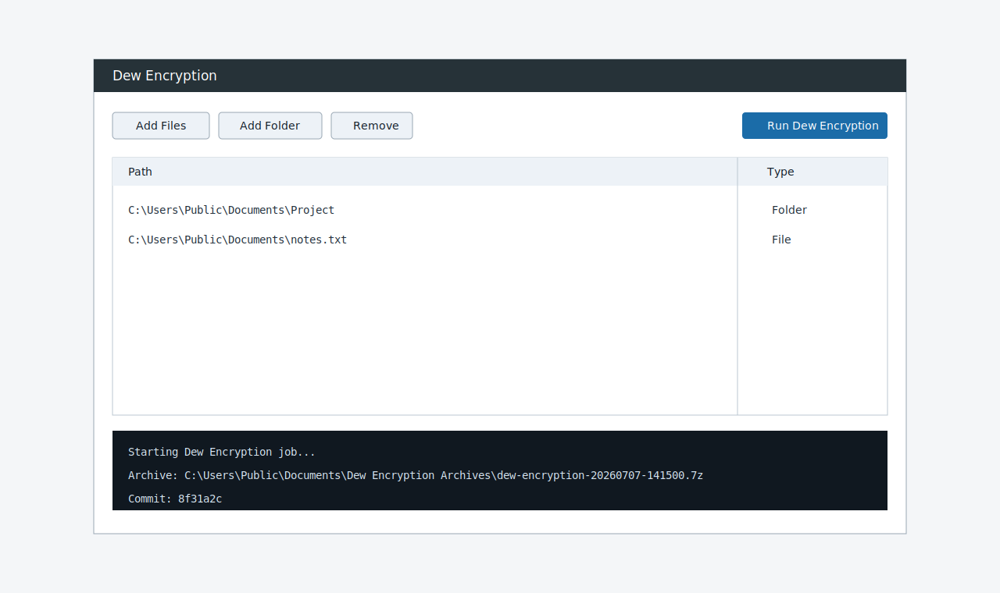

# Dew Encryption

Dew Encryption is a small Windows utility that adds a normal Explorer right-click action named `dew encryption`. It snapshots the selected file or folder into a local Git repository, commits the current contents, and compresses that repository into a `.7z` archive.

It also includes a simple GUI file manager for selecting files and running the same workflow without using Explorer.

## Screenshots





## Requirements

- Windows 10 or later, or Linux with a desktop session
- Python 3.10+
- Git
- 7-Zip with `7z` available on `PATH`
- VeraCrypt for VeraCrypt container encrypt/decrypt actions

## Windows Install

Fully automated install, including dependencies when `winget` is available:

```powershell
irm https://raw.githubusercontent.com/codingmachineedge/dew-encryption/main/installer/install.ps1 | iex
```

That command installs or verifies Python, Git, and 7-Zip, clones this repo into `%LOCALAPPDATA%\DewEncryption`, installs the Python package, and registers the Explorer context menu.

Manual install:

```powershell
git clone https://github.com/codingmachineedge/dew-encryption.git
cd dew-encryption
python -m pip install -e .
powershell -ExecutionPolicy Bypass -File .\installer\install-context-menu.ps1
```

The installer writes only to `HKCU`, so it does not require administrator rights. The menu entry is registered for files, folders, and folder background right-clicks, and it does not require holding Shift.

Full Windows `.exe` installer:

```powershell
.\scripts\build-windows-installer.ps1
```

The release workflow builds `DewEncryptionSetup.exe` with Inno Setup. It installs CLI and GUI executables, Start Menu entries, app icons, and Explorer right-click actions.

## Linux Install

```bash
git clone https://github.com/codingmachineedge/dew-encryption.git
cd dew-encryption
bash linux/install.sh
```

The Linux installer installs the Python package for the current user, adds a desktop launcher, installs the app icon, and adds Nautilus scripts where supported.

Linux uninstall:

```bash
bash linux/uninstall.sh
```

## Full CLI Mode

Available on Windows and Linux:

```powershell
dew-encryption --help
dew-encryption C:\Path\To\Folder
dew-encryption watch C:\Path\To\Folder --interval 5
dew-encryption history "C:\Path\To\Folder\Dew Encryption Archives\.dew-encryption-repo"
dew-encryption details "C:\Path\To\Folder\Dew Encryption Archives\.dew-encryption-repo" abc1234
dew-encryption restore "C:\Path\To\Folder\Dew Encryption Archives\.dew-encryption-repo" abc1234 C:\Path\To\Folder
```

On Linux, use normal POSIX paths with the same commands.

## Full GUI Mode

Available on Windows and Linux:

```powershell
dew-encryption-gui
```

Open directly to a folder's history manager:

```powershell
dew-encryption-gui C:\Path\To\Folder --history
```

## GitHub Pages

Project page:

https://codingmachineedge.github.io/dew-encryption/

The page is deployed by `.github/workflows/pages.yml` from the `docs/` folder.

## GitHub Actions

- `.github/workflows/ci.yml` compiles the package, parses installer scripts, installs 7-Zip, and runs a real snapshot smoke test on Windows.
- `.github/workflows/release.yml` builds a zip bundle on tag pushes like `v0.1.0` or manual workflow runs.
- `.github/workflows/pages.yml` deploys `docs/` to GitHub Pages.

## Use From Explorer

1. Right-click a file or folder.
2. Choose `dew encryption`.
3. Find the output under `Dew Encryption Archives` beside the selected item.

Each run creates or updates:

- `Dew Encryption Archives\.dew-encryption-repo`
- `Dew Encryption Archives\dew-encryption-YYYYMMDD-HHMMSS.7z`

Folders also get file-history actions in the normal Explorer menu:

- `dew encryption start file history` creates the local history repo and starts a hidden watcher that commits detected folder changes.
- `dew encryption file history manager` opens the detailed manager directly for that folder.

These entries are installed without administrator rights and do not require holding Shift.

Files and folders also get VeraCrypt container actions:

- `dew encryption VeraCrypt encrypt` creates a `.dew.hc` VeraCrypt container, copies the selected file or folder into it, dismounts the container, and removes the original by default.
- `.hc` files get `dew encryption VeraCrypt decrypt`, which mounts the container and restores the contents beside it.

These actions prompt for the VeraCrypt password in a console window. VeraCrypt must be installed separately.

## Use The GUI

```powershell
dew-encryption-gui
```

or:

```powershell
python -m dew_encryption.gui
```

The GUI includes a `History` tab. Select a file or folder, refresh history, and choose a commit to see commit metadata and changed files.

History manager actions:

- `Refresh History` reloads commits from the local repo.
- `Snapshot Now` commits the current selected folder state.
- `Start Auto History` watches for changes and commits them automatically.
- `Stop Auto History` stops the GUI watcher.
- `Create Archive` compresses the local history repo with 7-Zip.
- `Restore Selected` restores the selected file or folder to the chosen commit.
- `Open Source` opens the selected folder in Explorer.
- `Open Repo` opens the local `.dew-encryption-repo` folder.

## Automatic File History

Dew Encryption can watch selected paths and commit a new local history snapshot whenever files are added, changed, or deleted:

```powershell
dew-encryption watch C:\Path\To\Folder --interval 5
```

The GUI exposes the same behavior with `Start Auto History` and `Stop Auto History` in the `History` tab.

To inspect history from the command line:

```powershell
dew-encryption history "C:\Path\To\Folder\Dew Encryption Archives\.dew-encryption-repo"
```

To inspect a specific commit:

```powershell
dew-encryption details "C:\Path\To\Folder\Dew Encryption Archives\.dew-encryption-repo" abc1234
```

To restore a file or folder to a specific commit:

```powershell
dew-encryption restore "C:\Path\To\Folder\Dew Encryption Archives\.dew-encryption-repo" abc1234 C:\Path\To\Folder
dew-encryption veracrypt-encrypt C:\Path\To\File.txt
dew-encryption veracrypt-decrypt C:\Path\To\File.txt.dew.hc
```

## Optional Encrypted Archive

The CLI accepts a password for 7-Zip encryption:

```powershell
dew-encryption --password "change-me" C:\Path\To\Folder
```

When a password is supplied, the archive uses 7-Zip header encryption.

## Uninstall Explorer Menu

```powershell
powershell -ExecutionPolicy Bypass -File .\installer\uninstall-context-menu.ps1
```
