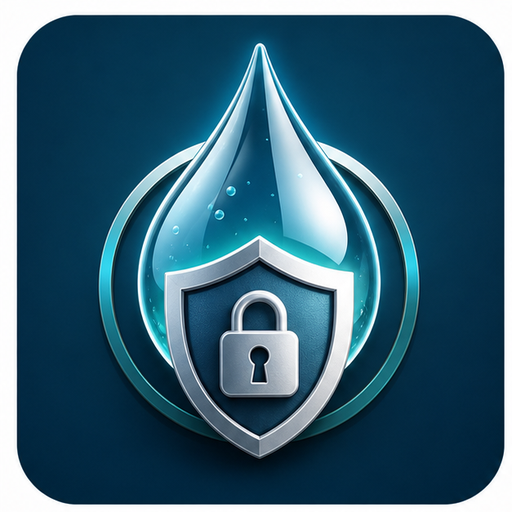
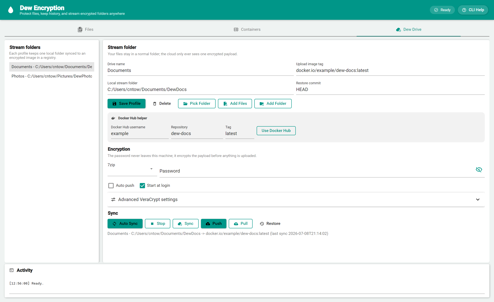
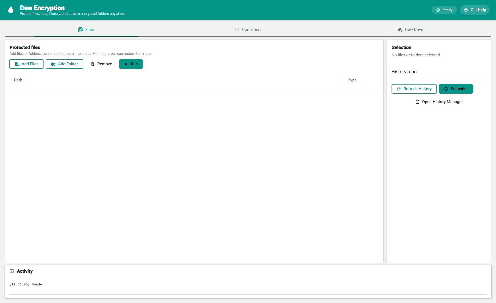
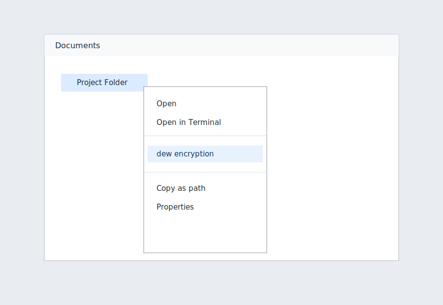

# Dew Encryption

Dew Encryption is a small Windows utility that adds a normal Explorer right-click action named `dew encryption`. It snapshots the selected file or folder into a local Git repository, commits the current contents, and compresses that repository into a `.7z` archive.

It also includes a modern GUI file manager for selecting files, managing file history, configuring VeraCrypt container profiles, customizing per-container themes, running open/close automations, and browsing Git-backed container history without using Explorer.

## Screenshots









## Requirements

- Windows 10 or later, or Linux with a desktop session
- Python 3.10+
- Git
- 7-Zip with `7z` available on `PATH`
- VeraCrypt for VeraCrypt container encrypt/decrypt actions

## Windows Install

Fully automated install, including dependencies when `winget` is available:

```powershell
irm https://raw.githubusercontent.com/codingmachineedge/dew-encryption/main/installer/install.ps1 | iex
```

That command installs or verifies Python, Git, and 7-Zip, clones this repo into `%LOCALAPPDATA%\DewEncryption`, installs the Python package, and registers the Explorer context menu.

Manual install:

```powershell
git clone https://github.com/codingmachineedge/dew-encryption.git
cd dew-encryption
python -m pip install -e .
powershell -ExecutionPolicy Bypass -File .\installer\install-context-menu.ps1
```

The installer writes only to `HKCU`, so it does not require administrator rights. The menu entry is registered for files, folders, and folder background right-clicks, and it does not require holding Shift.

### Windows 11 Modern Context Menu

Windows 11 shows simple registry verbs under `Show more options`. To place Dew Encryption in the new first-level Windows 11 context menu, build and register the native `IExplorerCommand` sparse-package integration:

```powershell
powershell -ExecutionPolicy Bypass -File .\installer\install-win11-context-menu.ps1
```

Prerequisites for this modern menu path:

- Visual Studio 2022 Build Tools with Desktop development with C++
- A Windows 11 SDK
- CMake
- .NET SDK, for the C# GUI package entry point

The Windows 11 installer builds `windows\context-menu\DewEncryptionExplorerCommand.dll`, generates a sparse package manifest, registers it with `Add-AppxPackage -ExternalLocation`, and restarts Explorer. The classic registry installer remains useful as a fallback and for commands that should also appear under `Show more options`.

Remove the Windows 11 modern integration:

```powershell
powershell -ExecutionPolicy Bypass -File .\installer\uninstall-win11-context-menu.ps1
```

Full Windows `.exe` installer:

```powershell
.\scripts\build-windows-installer.ps1
```

Every branch push runs `.github/workflows/installer.yml` and publishes a commit-specific installer artifact for 30 days. The artifact includes the SHA-named installer and its SHA-256 checksum. The installer uses Inno Setup and installs CLI and GUI executables, Start Menu entries, app icons, and Explorer right-click actions.

Portable Windows build:

- Download `DewEncryptionPortable.zip` from the release workflow artifacts or tagged releases.
- Extract it anywhere.
- Run `dew-encryption-gui.exe` for GUI mode or `dew-encryption.exe --help` for CLI mode.
- Settings are stored in `settings.json` beside the portable executables because the zip includes `portable.flag`.

To turn any local checkout or executable folder into portable mode:

```powershell
dew-encryption portable --init
dew-encryption portable --show
```

Portable mode can also be forced with `DEW_ENCRYPTION_PORTABLE=1`, or a custom settings path can be supplied with `DEW_ENCRYPTION_CONFIG`.

## Elevated Task Setup

Dew Encryption does not bypass UAC. If you want scheduled tasks for elevated launches, use the explicit setup action:

- Right-click a folder background.
- Choose `dew encryption create elevated tasks`.
- Approve the normal Windows administrator prompt.

To remove them, choose `dew encryption remove elevated tasks` or run:

```powershell
powershell -ExecutionPolicy Bypass -File .\installer\remove-elevated-tasks.ps1
```

The tasks are clearly named `DewEncryption.*.Elevated` and are created only after normal Windows consent.

## Linux Install

```bash
git clone https://github.com/codingmachineedge/dew-encryption.git
cd dew-encryption
bash linux/install.sh
```

The Linux installer installs the Python package for the current user, adds a desktop launcher, installs the app icon, and adds Nautilus scripts where supported.

Linux uninstall:

```bash
bash linux/uninstall.sh
```

## Full CLI Mode

Available on Windows and Linux:

```powershell
dew-encryption --help
dew-encryption C:\Path\To\Folder
dew-encryption watch C:\Path\To\Folder --interval 5
dew-encryption history "C:\Path\To\Folder\Dew Encryption Archives\.dew-encryption-repo"
dew-encryption details "C:\Path\To\Folder\Dew Encryption Archives\.dew-encryption-repo" abc1234
dew-encryption restore "C:\Path\To\Folder\Dew Encryption Archives\.dew-encryption-repo" abc1234 C:\Path\To\Folder
```

On Linux, use normal POSIX paths with the same commands.

## Full GUI Mode

Available on Windows and Linux. The current packaged GUI is Python/Tkinter, and a C# Avalonia GUI target is available under `csharp/DewEncryption.Gui` for the native cross-platform GUI goal:

```powershell
dew-encryption-gui
```

Open directly to a folder's history manager:

```powershell
dew-encryption-gui C:\Path\To\Folder --history
```


## Buildable Encrypted Source Manager

Create a special buildable encrypted source software file when you want to ship a whole GitHub checkout as one password-protected GUI manager. The generated Python file contains an encrypted 7-Zip copy of the entire Git repo, prompts for the password in its own Tkinter GUI, decrypts into the user's local cache, optionally pulls a remote branch, and then runs the build/run commands. Commands can be supplied explicitly, are auto-detected for common repository types, and remain editable in the generated GUI before launch.

```powershell
dew-encryption buildable-source create . .\DewEncryptedSourceManager.py `
  --password "change-me" `
  --remote https://github.com/codingmachineedge/dew-encryption.git `
  --branch main `
  --build-command "python -m pip install -e ." `
  --run-command "dew-encryption-gui"
```

How it knows how to build and run:

- Prefer explicit `--build-command` and `--run-command` values when you know the project-specific commands.
- If commands are omitted, Dew Encryption auto-detects common project files: `pyproject.toml`/`setup.py`, `package.json`, `.sln`/`.csproj`, `Cargo.toml`, and `Makefile`.
- The generated GUI shows the resolved build and run commands in editable fields before launch, so users can correct or customize them without rebuilding the encrypted manager.

When the manager starts:

- If it is the first run, it decrypts the baked source and runs the build command.
- If `--remote` was supplied and `git fetch`/fast-forward finds a newer version, it pulls, builds, and runs.
- If there is no new version or pull is disabled, it skips the build command and just runs the run command.

The generated manager requires Python, Git, and 7-Zip on the target machine. Keep the password private; the source payload is encrypted, but the build and run commands are stored in the manager file so the GUI can operate without extra configuration.

## C# GUI Target

The `csharp/DewEncryption.Gui` project is an Avalonia/.NET 8 desktop shell for Windows and Linux. It uses Material Design (Material.Avalonia theme, cards, floating-label fields, and Material icons) with a teal palette, and it drives the existing `dew-encryption` CLI so the C# interface can share the mature encryption, Git history, VeraCrypt, and hook workflows while the native UI is expanded. Rarely-needed VeraCrypt internals sit behind an "Advanced VeraCrypt settings" expander so the common sync flow stays simple.

```bash
dotnet restore csharp/DewEncryption.Gui/DewEncryption.Gui.csproj
dotnet build csharp/DewEncryption.Gui/DewEncryption.Gui.csproj
```

## GitHub Pages

Project page:

https://codingmachineedge.github.io/dew-encryption/

The page is deployed by `.github/workflows/pages.yml` from the `docs/` folder.

## GitHub Actions

- `.github/workflows/ci.yml` compiles the package, parses installer scripts, installs 7-Zip, and runs a real snapshot smoke test on Windows.
- `.github/workflows/installer.yml` builds and publishes a commit-specific Windows installer artifact on every branch push.
- `.github/workflows/release.yml` builds a zip bundle on tag pushes like `v0.1.0` or manual workflow runs.
- `.github/workflows/pages.yml` deploys `docs/` to GitHub Pages.

## Use From Explorer

1. Right-click a file or folder.
2. Choose `dew encryption`.
3. Find the output under `Dew Encryption Archives` beside the selected item.

Each run creates or updates:

- `Dew Encryption Archives\.dew-encryption-repo`
- `Dew Encryption Archives\dew-encryption-YYYYMMDD-HHMMSS.7z`

Folders also get file-history actions in the normal Explorer menu:

- `dew encryption start file history` creates the local history repo and starts a hidden watcher that commits detected folder changes.
- `dew encryption file history manager` opens the detailed manager directly for that folder.

These entries are installed without administrator rights and do not require holding Shift.


Docker files and folders also get Docker transfer actions:

- Right-click a Docker archive/container file and choose `dew encryption upload to Docker or custom remote` to open a GUI that can load/tag/push the archive to a Docker registry or run a custom upload command with `{file}` replaced by the selected path.
- Right-click inside a directory and choose `dew encryption save Docker image here` to open a GUI that lists current Docker images, containers, and volumes and saves the selected items into that directory as Docker export/archive files.

Files and folders also get VeraCrypt container actions:

- `dew encryption quick create container` creates a `.dew.hc` VeraCrypt container from the selected file or folder and automatically registers it in the GUI container manager.
- `dew encryption VeraCrypt encrypt` creates a `.dew.hc` VeraCrypt container, copies each selected file or folder into its own container, dismounts the container, and removes the original by default.
- `.hc` files get `dew encryption VeraCrypt decrypt`, which can decrypt one or more selected containers and restores their contents beside them.

These actions prompt for the VeraCrypt password in a console window. The automated PowerShell installer installs VeraCrypt with `winget` when it is missing; the full Windows installer includes the same VeraCrypt dependency task by default.

## Use The GUI

```powershell
dew-encryption-gui
```

or:

```powershell
python -m dew_encryption.gui
```

The GUI includes a `History` tab. Select a file or folder, refresh history, and choose a commit to see commit metadata and changed files. It also includes a `Containers` tab for a modern per-container manager on Windows and Linux.

History manager actions:

- `Refresh History` reloads commits from the local repo.
- `Snapshot Now` commits the current selected folder state.
- `Start Auto History` watches for changes and commits them automatically.
- `Stop Auto History` stops the GUI watcher.
- `Create Archive` compresses the local history repo with 7-Zip.
- `Restore Selected` restores the selected file or folder to the chosen commit.
- `Open Source` opens the selected folder in Explorer.
- `Open Repo` opens the local `.dew-encryption-repo` folder.

## Dew Drive Stream Folder

The C# GUI `Dew Drive` tab is the OneDrive-style workflow:

1. Pick or create a local stream folder.
2. Enter an upload image tag such as `ghcr.io/you/dew-drive:latest`. This is the Docker/OCI registry target, not a `Dockerfile`.
   For Docker Hub, use the `Docker Hub` helper row instead: type your Docker Hub username (repository and tag are optional) and click `Use Docker Hub` to fill the tag as `docker.io/you/dew-drive:latest`. Run `docker login` once so `Push` can upload.
3. Choose `veracrypt` encryption and enter the sync password.
4. Save your VeraCrypt settings or use `Install VeraCrypt`.
5. Use `Auto Sync` to watch local file changes, encrypt the folder, build the Docker image, and push it.
6. Enable `Startup` and mark profiles with `Auto push` to resume the watcher when this Windows user signs in.
7. Select a saved profile to see when it last synced; every successful sync updates the stored timestamp.
8. Use `Delete` to remove a saved profile and stop its watcher. The local stream folder stays on disk.

CLI passwords are passed to the sync process through `DEW_DRIVE_PASSWORD`. In the C# GUI, an entered Dew Drive password is stored as a Windows current-user protected secret so startup auto-sync can continue on the same machine. The local folder is still a normal folder on disk; remote storage is the encrypted payload inside the Docker/OCI image.

The image-level `metadata.json` contains only the encryption mode and payload file name. The drive name, source path, and per-file manifest (names, sizes, hashes) ride inside the encrypted payload as a reserved root-level `.dew-drive-metadata.json`, so a public registry learns nothing about your files. Pull strips that reserved file from the restored output and uses it for per-file size and SHA-256 validation; sync skips a stale copy left at the drive root by an older app's restore. Images pushed by older versions, which carried a plaintext manifest, still pull and restore normally.

## Container Manager, Themes, And Hooks

The `Containers` GUI tab stores settings per encrypted container:

- Custom theme background, foreground, accent, font family, and font size.
- Git-backed file history for each container file, with snapshot, refresh, and open-repo actions in the GUI.
- Multiple `open` actions and multiple `close` actions per container.
- Action types for shell scripts/commands, Discord webhooks, and Home Assistant webhooks.
- Template variables in action targets and payloads: `{event}`, `{container}`, `{container_name}`, `{container_stem}`, `{mount_path}`, `{user}`, `{host}`, and `{timestamp}`.

Script actions run cross-platform with the same template variables also exposed as environment variables such as `DEW_EVENT`, `DEW_CONTAINER`, and `DEW_MOUNT_PATH`. Webhook actions post JSON to the configured URL. Discord actions can use a payload like:

```json
{"content":"{container_name} was {event} by {user} on {host}"}
```

Home Assistant webhook actions can point at a URL such as:

```text
https://homeassistant.local:8123/api/webhook/dew-container-open
```

The CLI can snapshot and inspect the Git history for container files, then run configured hooks so mount/open workflows or external VeraCrypt launchers can trigger the same automation on both Windows and Linux:

```powershell
dew-encryption container-history C:\Path\To\Secrets.dew.hc --snapshot
dew-encryption container-history C:\Path\To\Secrets.dew.hc
dew-encryption container-hooks open C:\Path\To\Secrets.dew.hc --mount-path X:\
dew-encryption container-hooks close C:\Path\To\Secrets.dew.hc --mount-path X:\
```

Quick-create containers from Explorer or Nautilus with:

```powershell
dew-encryption container-quick-create C:\Path\To\Folder
```

On Linux, the installer adds `dew encryption quick create container` to the Nautilus scripts menu.

## Automatic File History

Dew Encryption can watch selected paths and commit a new local history snapshot whenever files are added, changed, or deleted:

```powershell
dew-encryption watch C:\Path\To\Folder --interval 5
```

The GUI exposes the same behavior with `Start Auto History` and `Stop Auto History` in the `History` tab.

To inspect history from the command line:

```powershell
dew-encryption history "C:\Path\To\Folder\Dew Encryption Archives\.dew-encryption-repo"
```

To inspect a specific commit:

```powershell
dew-encryption details "C:\Path\To\Folder\Dew Encryption Archives\.dew-encryption-repo" abc1234
```

To restore a file or folder to a specific commit:

```powershell
dew-encryption restore "C:\Path\To\Folder\Dew Encryption Archives\.dew-encryption-repo" abc1234 C:\Path\To\Folder
dew-encryption veracrypt-encrypt C:\Path\To\File.txt C:\Path\To\Folder
dew-encryption veracrypt-decrypt C:\Path\To\File.txt.dew.hc C:\Path\To\Folder.dew.hc
dew-encryption veracrypt-settings --show
```

## VeraCrypt Settings

The GUI has a `VeraCrypt` tab for remembered defaults. The CLI can update the same settings:

```powershell
dew-encryption veracrypt-settings --encryption AES --hash SHA-512 --filesystem exFAT --pim 0
dew-encryption veracrypt-settings --size-padding-mb 64 --size-multiplier 1.25 --minimum-size-mb 32
dew-encryption veracrypt-settings --keep-source-after-encrypt false --keep-container-after-decrypt true
dew-encryption veracrypt-settings --veracrypt-path "C:\Program Files\VeraCrypt\VeraCrypt.exe"
```

Settings are remembered under the user profile. Passwords are intentionally not remembered in plaintext; right-click actions prompt for the VeraCrypt password.

## Optional Encrypted Archive

The CLI accepts a password for 7-Zip encryption:

```powershell
dew-encryption --password "change-me" C:\Path\To\Folder
```

When a password is supplied, the archive uses 7-Zip header encryption.

## Uninstall Explorer Menu

```powershell
powershell -ExecutionPolicy Bypass -File .\installer\uninstall-context-menu.ps1
```
